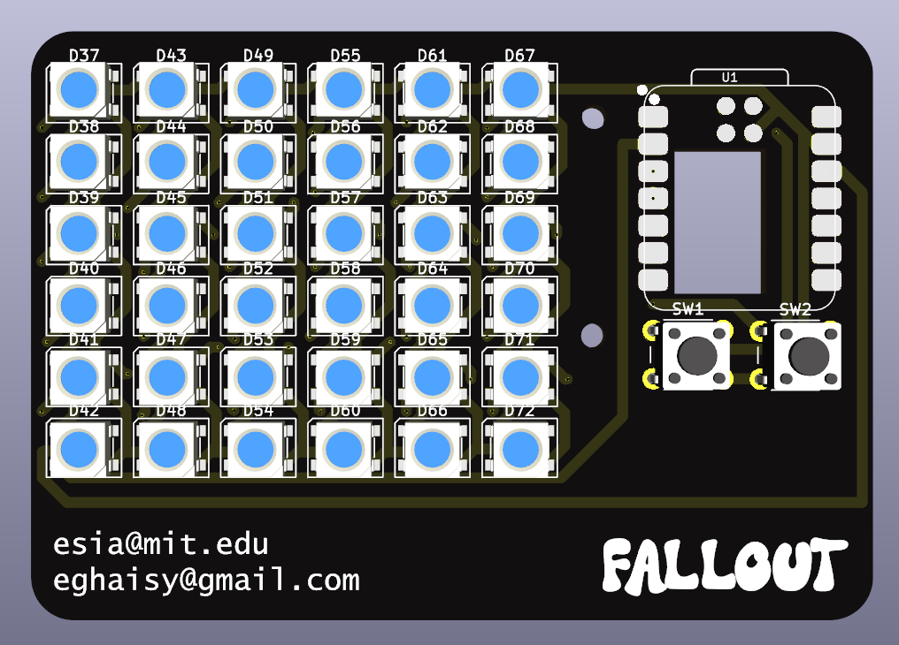
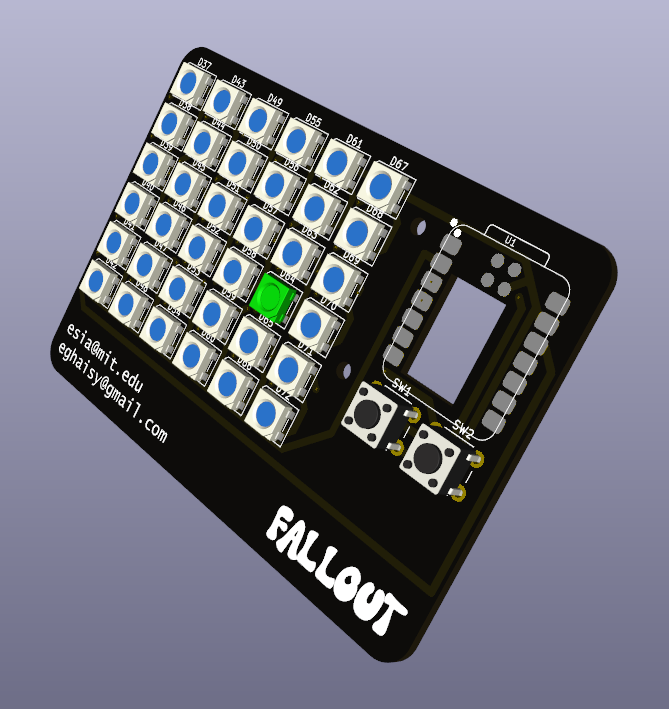
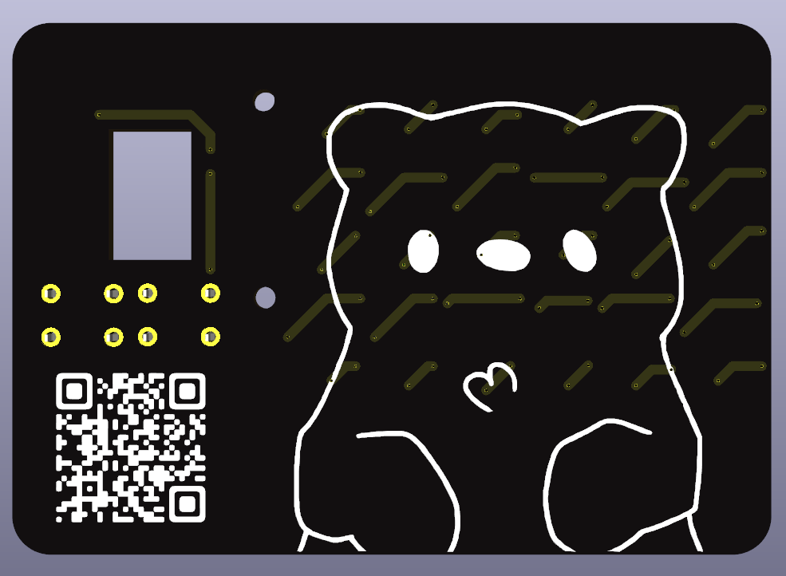
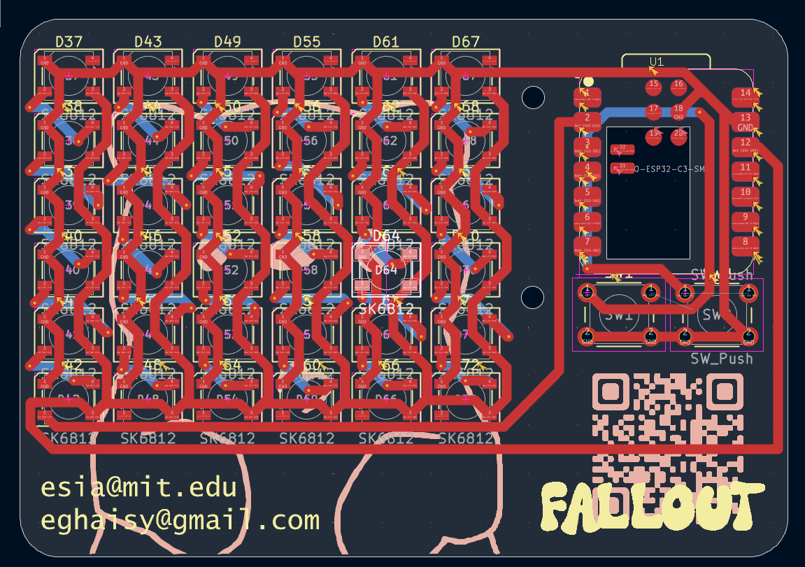
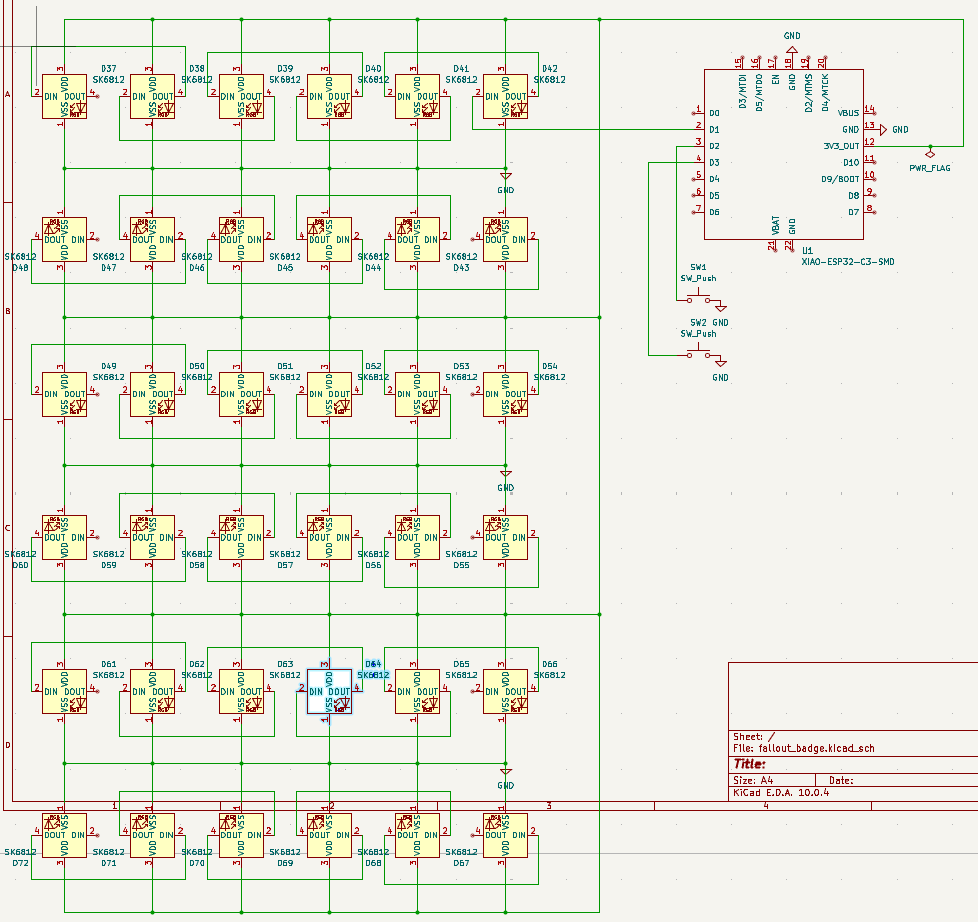

Made in one day during Fallout IRL hackathon.

This business badge features:
36 neopixel leds emulating a display
2 buttons for input and led setting changes
esp32 c3 for managing inputs and controlling leds

## BOM:

@flush on slack
